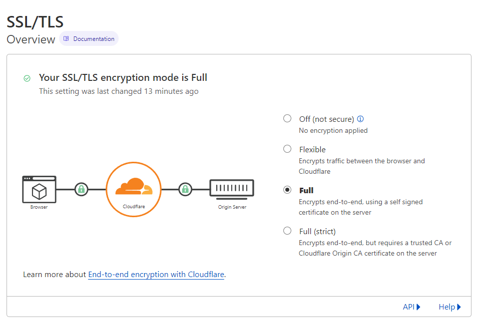

# EFnet.social Mastodon Deploy Configuration

This repository contains configuration (minus secrets) for
the [efnet.social](https://efnet.social) Mastodon instance.

You can fork this repository and use it as a template for your own.

## Prerequisites

- Docker with `docker-compose` (latest)
- Some kind of sh-compatible shell.

## Setup & Deploy

1. Clone this repository: `git clone https://github.com/lsegal/efnet.social`
2. Copy `.env.production.sample` to `.env.production` and add your secrets.
   See the [Mastodon documentation](https://docs.joinmastodon.org/admin/config/)
   for available environment options.
3. Run `sh scripts/setup.sh` to initialize the configuration and database.
4. Optional: if you are using your own certificates, you will need to replace
   the files generated into `conf/certs`. See below for more information.
5. Finally, run `docker-compose up -d` to start the server.

## SSL and Certificates

This deploy relies on Cloudflare for SSL management. Specifically, we use
the "Full" end-to-end setting in SSL/TLS > Overview. This means that you should
ensure that Cloudflare is accessing your server on port 443. Failure to setup
your service over HTTPS may result in a redirect loop.

If you are not using Cloudflare, you will need to generate your own certificates.
This can be done by replacing the certificates in `conf/certs` and updating
`config/nginx-templates/default.conf.template`.

## Tools and Maintenance

The `scripts` directory contains a few useful tools for managing your instance,
most of which are wrappers around `docker-compose` commands available in
the standard Mastadon tool chain.

- `scripts/console.sh` provides access to the Rails console in your Mastodon instance.
- `scripts/tootctl.sh` provides access to [Mastoson's tootctl admin CLI](https://docs.joinmastodon.org/admin/tootctl/).
